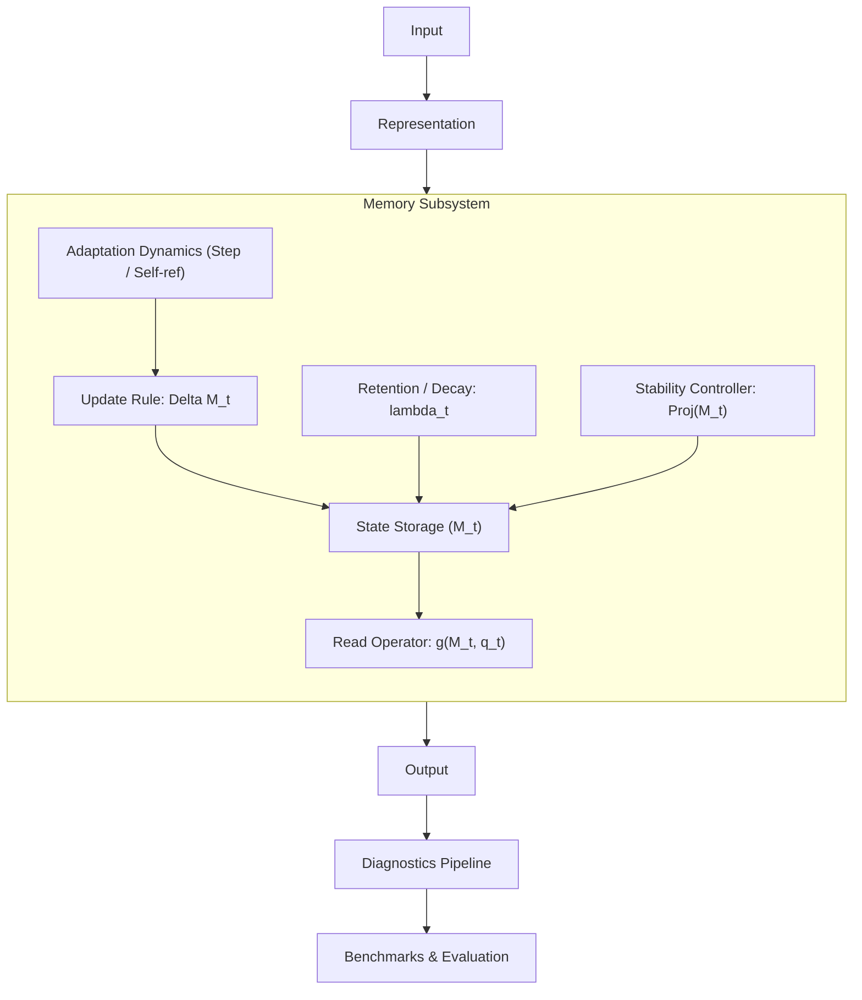

# DeltaCore Architecture Specification

This document details the conceptual architecture of **DeltaCore**, a modular research toolkit for neural systems that adapt their internal state during inference.

---

## 1. Conceptual Architecture Diagram

The design decouples representations, memory storage, transition mathematics, stability enforcement, and execution strategies into isolated, composable primitives.

```
       +---------------------------------------------+
       |                    Input                    |
       +---------------------------------------------+
                              |
                              v
       +---------------------------------------------+
       |               Representation                |
       +---------------------------------------------+
                              |
                              v
       +---------------------------------------------+
       |                   Memory                    |
       |  +---------------------------------------+  |
       |  |  State: M_t                           |  |
       |  +---------------------------------------+  |
       |  |                                       |  |
       |  +--> Read: v_retrieved = g(M_t, q_t)    |  |
       |  |                                       |  |
       |  +--> Update Rule: \Delta M_t = f(...)   |  |
       |  |                                       |  |
       |  +--> Adaptation Dynamics: \eta_t = ...  |  |
       |  |                                       |  |
       |  +--> Retention: \lambda_t * M_t         |  |
       |  |                                       |  |
       |  +--> Stability Controller: Proj(M_t)    |  |
       +---------------------------------------------+
                              |
                              v
       +---------------------------------------------+
       |                   Output                    |
       +---------------------------------------------+
                              |
                              v
       +---------------------------------------------+
       |                 Diagnostics                 |
       +---------------------------------------------+
                              |
                              v
       +---------------------------------------------+
       |                 Benchmarks                  |
       +---------------------------------------------+
```

### Flowchart Representation (Mermaid)



---

## 2. Decomposition of Abstractions

In standard recurrent or attention models, projection, memory state, update mechanisms, and normalization are frequently compressed into a single monolithic operator (e.g., a fused attention kernel or linear RNN layer). DeltaCore explicitly decomposes these into separate mathematical abstractions to enable targeted research and isolated benchmarking.

### 2.1. Input & Representation
- **Role**: Transforms raw tokens, continuous signals, or multi-modal embeddings into structured query ($q_t$), key ($k_t$), and value ($v_t$) feature spaces.
- **Why Separate**: Representation spaces can be frozen, pre-trained, linear, or non-linear without altering how associative memory states store or recall patterns. Isolating representation allows researchers to ask: *Is a failure caused by insufficient feature rank, or by memory interference?*

### 2.2. Memory (State Container)
- **Role**: Maintains the internal state tensor ($M_t \in \mathbb{R}^{d_k \times d_v}$, or higher-order associative tensors).
- **Why Separate**: Separating state storage from the state transition logic ensures that different storage shapes, memory topologies (e.g., matrix, multi-head, factored low-rank, hierarchical), and initialization regimes can be studied independently.

### 2.3. Read Operator
- **Role**: Queries the memory state without modifying it: $v_t^{\text{retrieved}} = g(M_t, q_t)$.
- **Why Separate**: Read operations may be linear ($M_t q_t$), normalized (e.g., softmax-scaled or cosine similarity), or iterative (hopfield-style settling). Decoupling reading ensures update rules can be altered without altering retrieval physics.

### 2.4. Update Rule
- **Role**: Computes the directional modification tensor $\Delta M_t = f(k_t, v_t, M_t, \dots)$.
- **Why Separate**: The update operator determines *how* new associative bindings are formed. Examples include:
  - Standard outer-product (Hebbian / linear attention): $\Delta M_t = v_t k_t^T$
  - Error-correcting delta rule: $\Delta M_t = (v_t - M_{t-1} k_t) k_t^T$
  - Higher-order momentum or gradient-based test-time steps.
  Decoupling the update rule allows rigorous head-to-head empirical comparisons between Hebbian and Delta updates while holding all other layer components constant.

### 2.5. Adaptation Dynamics
- **Role**: Computes time-varying or input-dependent parameters governing adaptation (e.g., dynamic learning rates $\eta_t$, self-referential feedback, meta-learned modulation).
- **Why Separate**: Adaptation dynamics modulate the *tempo and responsiveness* of the update rule. By treating dynamics as a standalone abstraction, researchers can verify whether dynamic step-sizes prevent memory saturation or induce chaotic oscillations.

### 2.6. Retention & Forgetting
- **Role**: Regulates memory persistence across time via decay factors $\lambda_t \in [0, 1]$ or continuous-time discount operators: $M_t = \lambda_t M_{t-1} + \Delta M_t$.
- **Why Separate**: Retention controls the effective memory horizon independently of the update direction. Conflating retention with update magnitudes hides catastrophic forgetting and makes spectral decay analysis impossible.

### 2.7. Stability Controller
- **Role**: Explicitly bounds and projects memory states into numerically well-conditioned manifolds (e.g., spectral normalization, Frobenius norm clipping, trace constraints, matrix soft-thresholding).
- **Why Separate**: Adaptive state models are prone to runaway divergence when feedback loops compound across long sequences. A dedicated stability controller guarantees bounds without hacking ad-hoc epsilon constants into the update rule.

### 2.8. Output
- **Role**: Projects retrieved memory states and residual representations into the target output manifold (e.g., vocabulary logits, regression targets, token embeddings).
- **Why Separate**: Keeps downstream loss calculations and task heads separate from inner state dynamics.

### 2.9. Diagnostics
- **Role**: Non-invasive runtime observation pipeline. Tracks Frobenius norm $\|M_t\|_F$, singular value spectra, update magnitudes $\|\Delta M_t\|$, condition numbers, and numerical anomalies ($NaN$, $Inf$, loss of precision).
- **Why Separate**: Diagnostic hooks must never alter state computations or require invasive modifications to production or evaluation loops.

### 2.10. Benchmarks
- **Role**: Controlled empirical testbeds evaluating capacity (associative recall), stability (long-horizon recurrence), adaptivity (in-context adaptation to non-stationary inputs), and computational efficiency.
- **Why Separate**: Decoupled benchmarks ensure evaluation suites remain objective, standard, and reusable across baseline models and experimental configurations.

---

## 3. Strict Development Constraint

> **Important**: This architecture specification defines the conceptual decomposition for the DeltaCore project. **Do not implement speculative components merely because they appear in this diagram.**
>
> Implementation proceeds strictly according to the phase-gated roadmap defined in [ROADMAP.md](file:///Users/urjasoft/Documents/DeltaCore/docs/ROADMAP.md). In Phase 0, only package infrastructure, documentation, configuration, and environment validation are created.
