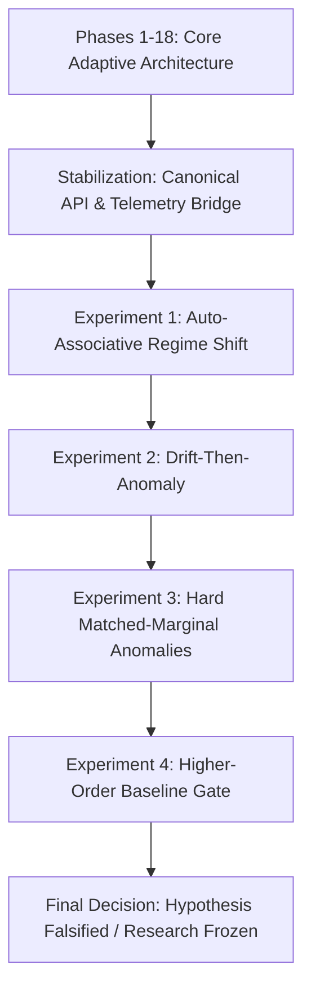

# DeltaCore: Experimental Progression & Benchmark Archive

**Status**: Authoritative Benchmark & Scientific History Archive  
**Version**: `0.2.0`  
**Date**: 2026-10-07  

This document catalogs the complete experimental trajectory of the DeltaCore project, recording all benchmark methodologies, reproduction commands, artifact locations, and empirical findings.

---

## Experimental Trajectory Overview



---

## 1. Phases 1–18: Core Adaptive-State Research (Foundational)

- **Purpose**: Implement pure-PyTorch mathematical primitives for test-time adaptive associative neural memory ($M_t$), stability controllers (Lyapunov contractive step-size), Hebbian and Delta update rules, parallel affine scans, and 2D classification transfer.
- **Key Result**: Validated local contractive step stability $|1 - \eta_t \|x_t\|^2| \le 1$, deterministic parameter immutability, causal state adaptation, and $4D^2$ byte memory scaling.
- **Tests**: 677 unit tests covering autograd backward passes, numerical edge cases, and affine scan equivalence.

---

## 2. Pre-RecoveryOS Stabilization Phase

- **Purpose**: Establish canonical, frozen public API (`AdaptiveController`, `ControllerConfig`, `DeterministicFeatureHasher`, `save_state`/`load_state`) with atomic state persistence and corruption detection.
- **Verification**: Verified pre-update residual semantics (`score()` non-mutating), state contract, and SHA-256 state hashing.
- **Artifact**: `examples/basic_adaptation.py`.

---

## 3. Experiment 1: Auto-Associative Regime Shift

- **Script**: `experiments/auto_associative_regime_shift.py`
- **Purpose**: First evaluation of auto-associative controller $M_t x_t \approx x_t$ on microservice telemetry under non-stationary regime shift.
- **Key Finding**: DeltaCore adapted to continuous drift and detected severe anomalies. However, baseline comparisons were limited to simple static and online centroids, leaving open whether second-order covariance methods could achieve the same performance.

---

## 4. Experiment 2: Drift-Then-Anomaly Benchmark

- **Script**: `experiments/drift_then_anomaly.py`
- **Purpose**: Evaluate adaptation to gradual distribution drift followed by later anomaly injection across 10 evaluation seeds.
- **Baseline Models**: Static Centroid, Online Centroid, Robust Huber Centroid, Static PCA, Online PCA, DeltaCore Continuous, DeltaCore Gated.
- **Key Finding**: DeltaCore Gated outperformed Online Centroid on synthetic correlation breaks. However, marginal distributions between nominal and anomaly streams were partially conflated due to synthetic token generation.

---

## 5. Experiment 3: Hard Matched-Marginal Regime Shift Benchmark

- **Script**: `experiments/hard_regime_shift.py`
- **Purpose**: Correct benchmark validity defects by requiring matched marginal distributions between nominal and anomalous regimes to prevent token frequency shortcuts.
- **Key Finding**: Confirmed that DeltaCore detects correlation violations without token novelty. However, the evaluation lacked a proper second-order adaptive baseline (Online Covariance / Mahalanobis distance) and an independent held-out Phase-C nominal reference.

---

## 6. Experiment 4: Higher-Order Baseline & Evaluation Gate (Decisive Gate)

- **Script**: `experiments/higher_order_regime_shift.py` (`v3.0.0`)
- **Pre-Registered Config**: `experiments/configs/higher_order_gate.yaml`
- **JSON Artifact**: `experiments/artifacts/higher_order_regime_shift_results.json`
- **Report Artifact**: `experiments/artifacts/higher_order_regime_shift_report.md`
- **Plots Directory**: `experiments/artifacts/higher_order_regime_shift_plots/` (15 publication figures)
- **Execution Command**:
  ```bash
  python experiments/higher_order_regime_shift.py
  ```

### Design & Methodology
1. **Decoupled Reference Distribution**: An independent, held-out Phase-C reference ($N = 1,000$) generated using a dedicated calibration PRNG.
2. **Strict Marginal Matching**: Tested 5 hard anomaly families (H1: Correlation Break, H2: Higher-Order 3-Way XOR Parity, H3: Markov Temporal Inversion, H4: Operational Contradiction, H5: Conditional Shift), all verified to satisfy $\text{TVD} \le 0.05$ against held-out Phase C.
3. **Proper Second-Order Baseline**: Implemented **Online Covariance with regularized Mahalanobis distance** ($\Sigma_t = \beta \Sigma_{t-1} + (1-\beta)(x-\mu)(x-\mu)^T$, $\lambda=10^{-3}$, $d_t = \sqrt{(x-\mu)^T(\Sigma+\lambda I)^{-1}(x-\mu)}$) consuming the same $4D^2$ state memory.
4. **Blind Scoring Safeguard**: Scoring loop executed strictly without access to test labels, validated by regression test `tests/test_benchmark_blind_execution.py`.
5. **Rigorous Paired Statistics**: 20 independent paired seeds with paired bootstrap 95% CIs ($B = 10,000$), exact two-sided binomial sign test, and paired permutation sign-flip test ($100,000$ permutations).

### Decisive Empirical Results (20 Seeds)

| Comparison Metric | Value | Statistical Significance |
| :--- | :---: | :--- |
| **DeltaCore Gated Mean AUROC** | 0.5711 $\pm$ 0.0801 | 95% CI: [0.5365, 0.6071] |
| **Online Covariance Mean AUROC** | **0.5976 $\pm$ 0.0667** | 95% CI: [0.5697, 0.6271] |
| **Mean Paired Difference ($\text{DC} - \text{Cov}$)** | **-0.0265** | 95% Bootstrap CI: **[-0.0478, -0.0072]** (excludes 0) |
| **Paired Cohen's $d$** | **-0.58** | Medium negative effect size |
| **Exact Two-Sided Binomial Sign Test** | **$p = 0.0118$** | DeltaCore won on only 4 of 20 seeds ($p < 0.05$) |
| **Paired Permutation (Sign-Flip) Test** | **$p = 0.0192$** | Randomization test rejects null ($p < 0.05$) |
| **DeltaCore vs. Gated Online Centroid** | +0.0382 | 95% CI: [+0.0205, +0.0541], $p_{\text{sign}} = 0.0004$ |

### Scientific Outcome
The evaluation gate concluded with a formal verdict of **FAIL**. Online Covariance matches or outperforms DeltaCore once proper second-order adaptation is introduced.

---

## 7. Negative Findings Preservation

In accordance with scientific integrity rules, all negative findings are formally preserved:
1. **DeltaCore does not outperform Online Covariance** under matched marginals.
2. **DeltaCore suffers from anomaly absorption** under continuous adaptation unless external score-gating is enforced.
3. **DeltaCore cannot detect temporal anomalies** from event-only representations without explicit lag features.
4. **Representation interactions (pairs/triples)** explain the majority of cross-feature anomaly detection capability, benefiting classical statistical methods equally or more.
