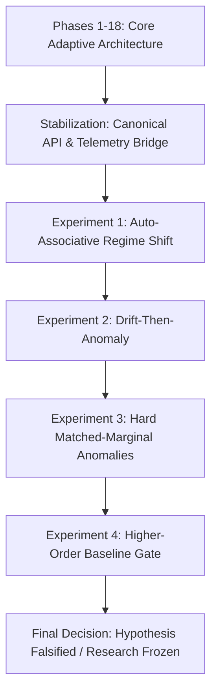

# DeltaCore: Experimental Progression & Benchmark Archive

**Status**: Authoritative Benchmark & Scientific History Archive  
**Version**: `0.2.0`  
**Date**: 2026-10-07  

This document catalogs the complete experimental trajectory of the DeltaCore project, recording all benchmark methodologies, reproduction commands, artifact locations, and empirical findings.

---

## Experimental Trajectory Overview



---

## 1. Phases 1–18: Core Adaptive-State Research (Foundational)

- **Purpose**: Implement pure-PyTorch mathematical primitives for test-time adaptive associative neural memory ($M_t$), stability controllers (Lyapunov contractive step-size), Hebbian and Delta update rules, parallel affine scans, and 2D classification transfer.
- **Key Result**: Validated local contractive step stability $|1 - \eta_t \|x_t\|^2| \le 1$, deterministic parameter immutability, causal state adaptation, and $4D^2$ byte memory scaling.
- **Tests**: 677 unit tests covering autograd backward passes, numerical edge cases, and affine scan equivalence.

---

## 2. Pre-RecoveryOS Stabilization Phase

- **Purpose**: Establish canonical, frozen public API (`AdaptiveController`, `ControllerConfig`, `DeterministicFeatureHasher`, `save_state`/`load_state`) with atomic state persistence and corruption detection.
- **Verification**: Verified pre-update residual semantics (`score()` non-mutating), state contract, and SHA-256 state hashing.
- **Artifact**: `examples/basic_adaptation.py`.

---

## 3. Experiment 1: Auto-Associative Regime Shift

- **Script**: `experiments/auto_associative_regime_shift.py`
- **Purpose**: First evaluation of auto-associative controller $M_t x_t \approx x_t$ on microservice telemetry under non-stationary regime shift.
- **Key Finding**: DeltaCore adapted to continuous drift and detected severe anomalies. However, baseline comparisons were limited to simple static and online centroids, leaving open whether second-order covariance methods could achieve the same performance.

---

## 4. Experiment 2: Drift-Then-Anomaly Benchmark

- **Script**: `experiments/drift_then_anomaly.py`
- **Purpose**: Evaluate adaptation to gradual distribution drift followed by later anomaly injection across 10 evaluation seeds.
- **Baseline Models**: Static Centroid, Online Centroid, Robust Huber Centroid, Static PCA, Online PCA, DeltaCore Continuous, DeltaCore Gated.
- **Key Finding**: DeltaCore Gated outperformed Online Centroid on synthetic correlation breaks. However, marginal distributions between nominal and anomaly streams were partially conflated due to synthetic token generation.

---

## 5. Experiment 3: Hard Matched-Marginal Regime Shift Benchmark

- **Script**: `experiments/hard_regime_shift.py`
- **Purpose**: Correct benchmark validity defects by requiring matched marginal distributions between nominal and anomalous regimes to prevent token frequency shortcuts.
- **Key Finding**: Confirmed that DeltaCore detects correlation violations without token novelty. However, the evaluation lacked a proper second-order adaptive baseline (Online Covariance / Mahalanobis distance) and an independent held-out Phase-C nominal reference.

---

## 6. Experiment 4: Higher-Order Baseline & Evaluation Gate (Decisive Gate)

- **Script**: `experiments/higher_order_regime_shift.py` (`v3.0.0`)
- **Pre-Registered Config**: `experiments/configs/higher_order_gate.yaml`
- **JSON Artifact**: `experiments/artifacts/higher_order_regime_shift_results.json`
- **Report Artifact**: `experiments/artifacts/higher_order_regime_shift_report.md`
- **Plots Directory**: `experiments/artifacts/higher_order_regime_shift_plots/` (15 publication figures)
- **Execution Command**:
  ```bash
  python experiments/higher_order_regime_shift.py
  ```

### Design & Methodology
1. **Decoupled Reference Distribution**: An independent, held-out Phase-C reference ($N = 1,000$) generated using a dedicated calibration PRNG.
2. **Strict Marginal Matching**: Tested 5 hard anomaly families (H1: Correlation Break, H2: Higher-Order 3-Way XOR Parity, H3: Markov Temporal Inversion, H4: Operational Contradiction, H5: Conditional Shift), all verified to satisfy $\text{TVD} \le 0.05$ against held-out Phase C.
3. **Proper Second-Order Baseline**: Implemented **Online Covariance with regularized Mahalanobis distance** ($\Sigma_t = \beta \Sigma_{t-1} + (1-\beta)(x-\mu)(x-\mu)^T$, $\lambda=10^{-3}$, $d_t = \sqrt{(x-\mu)^T(\Sigma+\lambda I)^{-1}(x-\mu)}$) consuming the same $4D^2$ state memory.
4. **Blind Scoring Safeguard**: Scoring loop executed strictly without access to test labels, validated by regression test `tests/test_benchmark_blind_execution.py`.
5. **Rigorous Paired Statistics**: 20 independent paired seeds with paired percentile bootstrap 95% CIs ($B = 10,000$, seed 42), exact two-sided binomial sign test, and exact paired sign-flip randomization test evaluating all $2^{20} = 1{,}048{,}576$ sign configurations.

### Decisive Empirical Results (20 Seeds)

| Comparison Metric | Value | Statistical Significance |
| :--- | :---: | :--- |
| **DeltaCore Gated Mean AUROC** | 0.5711 $\pm$ 0.0801 | 95% CI: [0.5365, 0.6071] |
| **Online Covariance Mean AUROC** | **0.5976 $\pm$ 0.0667** | 95% CI: [0.5697, 0.6271] |
| **Mean Paired Difference ($\text{DC} - \text{Cov}$)** | **-0.0265** | 95% Bootstrap CI: **[-0.0478, -0.0072]** (excludes 0) |
| **Paired Cohen's $d$** | **-0.58** | Medium negative effect size |
| **Exact Two-Sided Binomial Sign Test** | **$p = 0.0118$** | DeltaCore won on only 4 of 20 seeds ($p < 0.05$) |
| **Exact Paired Sign-Flip Randomization Test** | **$p = 0.0188$** | Evaluated all $2^{20} = 1{,}048{,}576$ sign configurations ($19,728$ extreme, $p = 0.0188$) |
| **DeltaCore vs. Gated Online Centroid** | +0.0382 | 95% CI: [+0.0205, +0.0541], $p_{\text{sign}} = 0.0004$ |
| **DeltaCore vs. Gated Online PCA** | +0.0070 | 95% CI: [-0.0074, 0.0209], $p = 0.8238$ |

### Canonical Benchmark Conclusion

Under the predefined 20-seed non-stationary matched-marginal benchmark, regularized Online Covariance significantly outperformed DeltaCore Gated under both the exact paired sign test and exact paired sign-flip randomization test. DeltaCore Gated did not demonstrate a performance advantage over regularized Online Covariance on the decisive benchmark.

### Statistical Interpretation & Epistemic Distinctions

The three inferential questions addressed by the evaluation are conceptually and mathematically distinct:

1. **Mean Effect Uncertainty (Resampling Bootstrap)**:
   - Evaluated via paired percentile bootstrap: 95% CI = `[-0.0478, -0.0072]` ($B=10,000$, seed 42).
   - The bootstrap interval for the mean paired difference excludes zero and is entirely negative for this benchmark.
   - *Mandatory Caveat*: This percentile bootstrap interval is a resampling-based uncertainty estimate. It is not an assumption-free or mathematically exact confidence interval.
2. **Randomization / Effect Magnitude (Exact Paired Sign-Flip Randomization Test)**:
   - Evaluates the magnitude of the observed paired mean difference ($|\bar{d}_{\text{obs}}| = 0.0265$) under the stated null of exchangeable signs across the 20 paired streams.
   - Exhaustively enumerates all $2^{20} = 1{,}048{,}576$ sign assignments, finding exactly 19,728 configurations as or more extreme than observed ($p = 19,728 / 1,048,576 \approx 0.0188$).
   - The p-value is exact with respect to exhaustive enumeration of the sign assignments under the specified exchangeability-of-signs null.
   - *Mandatory Caveat*: "Exact" refers to exhaustive enumeration under the stated null; it does not mean assumption-free inference. Exact enumeration removes Monte Carlo approximation error, but the inferential validity of the test remains conditional on the null and exchangeability assumptions specified by the test.
3. **Direction / Majority (Exact Two-Sided Binomial Sign Test)**:
   - Evaluates whether the direction of paired differences is consistent with a 50/50 sign null ($H_0: p = 0.5$).
   - Observed: DeltaCore wins = 4/20, DeltaCore loses = 16/20 ($p = 0.0118$).
   - Under the two-sided 50/50 sign null, the observed directional imbalance is statistically significant for this benchmark.

### Scope of Inference

The evidence is benchmark-specific. It establishes that, on the predefined 20-seed non-stationary matched-marginal benchmark with $D=128$ and the specified feature representation, DeltaCore Gated did not demonstrate an advantage over regularized Online Covariance, while the observed paired difference favored Online Covariance.

The benchmark does not establish universal superiority of Online Covariance, universal inferiority of DeltaCore, or performance ordering under telemetry distributions, dimensions, drift processes, workloads, or deployment conditions not represented by the benchmark.

The result therefore supports terminating this specific DeltaCore research direction for RecoveryOS, rather than claiming that adaptive telemetry detection as a broader problem has been solved.

### Practical vs. Statistical Significance

- **Statistical Evidence**: Mean paired AUROC difference = $-0.0265$, Paired Cohen's $d = -0.58$, exact sign $p = 0.0118$, exact randomization $p = 0.0188$. These metrics quantify the observed benchmark effect and should not be converted into a universal production-performance claim.
- **Engineering Trade-Offs**: DeltaCore incurred $O(D^2)$ state memory ($64\text{ KB}$ at $D=128$) and $8.6\times$ higher latency ($25.9\text{ µs}$ vs $3.0\text{ µs}$) than first-order centroids. Within the evaluated design and benchmark, DeltaCore incurred substantially greater state/latency cost without demonstrating a compensating performance advantage over regularized online covariance.

---

## 7. Negative Findings Preservation

In accordance with scientific integrity rules, all negative findings are formally preserved:
1. **DeltaCore did not demonstrate an empirical advantage over regularized Online Covariance** on the decisive matched-marginal benchmark.
2. **DeltaCore suffers from anomaly absorption** under continuous adaptation unless external score-gating is enforced.
3. **DeltaCore cannot detect temporal anomalies** from event-only representations without explicit lag features.
4. **Representation interactions (pairs/triples)** explain the majority of cross-feature anomaly detection capability, benefiting classical statistical methods equally or more.
